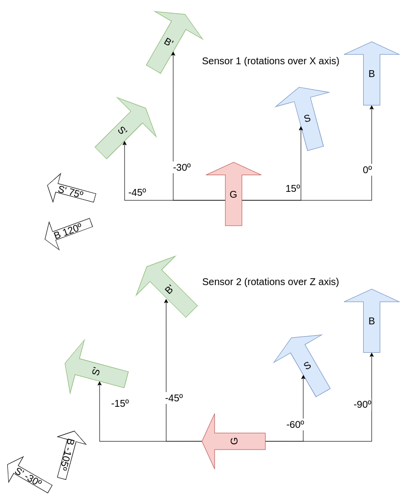

# Human arm kinematics tests

## Stored Data

In the folder `test/tst_data` some csv data files shall be found with different data to be use in different ways.

| Data                                              | Description |
| :--                                               | ----------- |
| data1_randomImuData.csv                           | Some random IMU data |
| data2_zRotations.csv                              | IMUs quaternions rotations over z axis | 
| data3_yRotations.csv                              | IMUs quaternions rotations over y axis | 
| data4_xRotations.csv                              | IMUs quaternions rotations over x axis | 
| data5_tst_cal_004_onArmArbitraryMotions.csv       | Measures of the IMUs while mounted on the arm and performing arbitrary motions | 
| data6_tst_cal_004_onArmArbitraryMotions.csv       | Measures of the IMUs while mounted on the arm and performing arbitrary motions | 
| data7_tst_cal_004_onArmArbitraryMotions.csv       | Measures of the IMUs while mounted on the arm and performing arbitrary motions (Longer period) | 
| data8_onArmAbductionFromTposeAndBack.csv          | Measures of the IMUs while mounted on the arm and performing abuction movements parallel to the ground |

## Specific test gides

### Calibration tests 5 and 6
These tests check the zeroing procedure of the rotation axis calibration following the next diagram:

